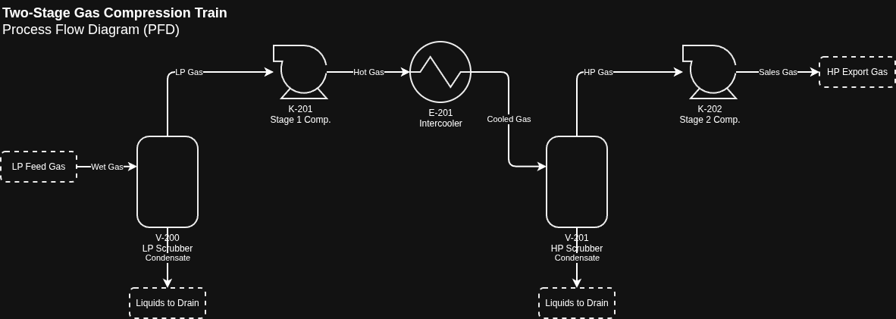
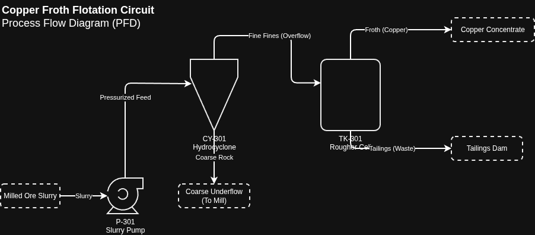
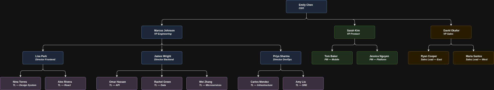

# 📐 Draw.io MCP Plugin

> Generate native, fully-editable draw.io diagrams from natural language — across all major AI coding assistants.

[](LICENSE)

> ⚠️ **Disclaimer:** This is a personal side project. It is provided "as is" with no warranty, no assumption of support, and no guarantee of continued maintenance. Use at your own risk. See [LICENSE](LICENSE) for full terms.

This plugin is a **wrapper and extension layer** built on top of the upstream [`@drawio/mcp`](https://github.com/jgraph/drawio-mcp) server by JGraph. It proxies all upstream MCP tools and adds 13 builder tools, a validation pipeline, domain-specific validators, and a topological correction engine — turning a basic "open XML in draw.io" server into a full diagramming assistant that generates **high-quality, native draw.io XML diagrams** from natural language.

> 💡 **How it works:** The upstream `@drawio/mcp` server provides four tools for opening diagrams in draw.io. This plugin wraps that server with a proxy ([`mcp-wrapper.js`](scripts/mcp-wrapper.js)) that intercepts MCP traffic, injects 13 additional builder tools, runs validation before forwarding XML, and applies topological corrections at finalize time. The upstream server is bundled as a pinned dependency (`@drawio/mcp@^1.3.4`) — you don't need to install it separately.

## ✨ Features

- **🎨 Native draw.io shapes** — Every diagram is built with native mxGraph XML, producing fully editable shapes, connectors, and containers
- **🏗️ Builder tools** — 13 MCP tools (`init_diagram`, `add_container`, `add_node`, `connect`, `finalize`, etc.) that handle layout, positioning, and styling automatically
- **🔍 Validation pipeline** — Bundled linter checks for layout collisions, formatting errors, and domain-specific topology violations before presenting diagrams
- **🧠 Domain experts** — Extensible system of reference docs, validator scripts, and auto-correction functions for specialized domains (AWS, PFD/P&ID, and more)
- **🔌 Multi-client support** — One installer for Kiro CLI, Claude Desktop, Claude Code, Cursor, Copilot CLI, and Antigravity
- **📁 Codebase-to-diagram** — Generate architecture, class, ER, and dependency diagrams directly from your project structure
- **🔄 Round-trip editing** — Read existing `.drawio` files, modify them, and re-render
- **📚 Rich skill knowledge** — Bundled reference docs and examples ensure the AI produces correct, beautiful diagrams on the first try
- **🔒 Security hardened** — Pinned package versions, atomic config writes, config backups, least-privilege agent access

## 🖥️ Supported Clients

| Client | What gets installed |
|--------|-------------------|
| **Kiro CLI** | Custom `@drawio` agent + full skill directory (SKILL.md, references, scripts) + MCP server registration |
| **Kiro IDE** | GUI Powers panel plugin setup |
| **Claude Desktop** | MCP server registration |
| **Claude Code** | Full skill directory (SKILL.md, references, scripts) + MCP server registration |
| **Cursor** | Native `.mdc` rule file + MCP server registration |
| **Copilot CLI** | Full skill directory (SKILL.md, references, scripts) + MCP server registration |
| **Antigravity** | Full skill plugin (SKILL.md, references, scripts) + MCP server registration |

## 📦 Prerequisites

- **Node.js** ≥ 24 and **npm** installed and in your PATH.

## 🚀 Installation

### 1. Native Agent Installations (Zero-Script)

Because this repository is structured as a standard plugin, you can install it directly using your agent's native CLI or UI:

**Antigravity**
```bash
agy plugin install https://github.com/jmo808/drawio_plugin.git
```

**GitHub Copilot CLI**
```bash
copilot plugin install https://github.com/jmo808/drawio_plugin.git
```

**Claude Code**
```bash
npx add-skill https://github.com/jmo808/drawio_plugin.git
# Or use /plugin install drawio within the Claude Code interface
```

**Kiro IDE**
- Open the **Powers** panel in the IDE
- Select **Add Custom Power** → **Import power from GitHub**
- Paste `https://github.com/jmo808/drawio_plugin.git`

**Cursor**
Simply drop the `.cursor/rules/drawio.mdc` file into your project, or use community sync tools to pull it from this repo.

---

### 2. Manual Universal Installer

If you prefer to install for *all* detected clients locally on your machine at once, you can use the bundled bash/powershell scripts.

#### macOS / Linux
```bash
git clone https://github.com/jmo808/drawio_plugin.git
cd drawio_plugin
chmod +x install.sh
./install.sh
```

#### Windows (PowerShell)
```powershell
git clone https://github.com/jmo808/drawio_plugin.git
cd drawio_plugin
powershell -ExecutionPolicy Bypass -File install.ps1
```

The installer:
1. Detects which clients are present (including **Kiro CLI**, Claude Desktop, etc.) and configures only those
2. Creates `.bak` backups of all modified config files
3. Verifies the `@drawio/mcp` package is accessible

### What gets installed

| Location | Contents |
|----------|----------|
| `~/.kiro/agents/drawio.json` | Kiro agent manifest (prompt points to skill) |
| `~/.kiro/skills/drawio/` | Kiro skill directory (SKILL.md, references, scripts) |
| `~/.gemini/config/plugins/drawio/` | Antigravity plugin (SKILL.md, references, scripts) |
| `~/.claude/skills/drawio/` | Claude Code skill directory (SKILL.md, references, scripts) |
| `~/.cursor/rules/drawio.mdc` | Cursor rule instructions |
| `~/.github/skills/drawio/` | Copilot skill directory (SKILL.md, references, scripts) |
| Various `mcp.json` / `config.json` | MCP server entry for each detected client |

## 🗑️ Uninstallation

### macOS / Linux
```bash
./uninstall.sh
```

### Windows
```powershell
powershell -ExecutionPolicy Bypass -File uninstall.ps1
```

Removes all installed files and cleans the `drawio` entry from every MCP config.

---

## 💬 Example: Generating a Diagram

Here's a real example of what using the plugin looks like. You type a natural-language prompt, and the AI generates native draw.io XML that opens directly in the draw.io editor.

### Prompt

```
Create a native draw.io diagram representing an AWS high-availability, decoupled three-tier web application utilizing both synchronous user traffic and asynchronous worker queues.
Component Requirements:
Regional Level (Outside VPC):
A User Client that initiates requests.
A Route 53 DNS endpoint.
A WAF Shield for request filtering.
A CloudFront CDN for edge caching.
An API Gateway managing the REST API.
A Task Queue (SQS) acting as the event buffer.
Network Level (VPC):
A Production VPC encapsulating the secure tiers.
Nested Availability Zones: us-east-1a and us-east-1b.
Within us-east-1a:
Public Subnet hosting an External ALB.
Private App Subnet hosting an ECS Web Task and a background ECS Worker Task.
Private Data Subnet hosting a Redis Cache A (ElastiCache) and a Primary DB (RDS).
Within us-east-1b:
Public Subnet hosting an External ALB.
Private App Subnet hosting an ECS Web Task and a background ECS Worker Task.
Private Data Subnet hosting a Redis Cache B (ElastiCache) and a Replica DB (RDS).
```

### What the AI does

1. **Identifies the diagram type** — cloud architecture with nested containers
2. **Enforces Cloud Topography** — Consults `aws-well-architected-reviewer.md` to prevent anti-patterns (no stateless compute replication, strictly segmented subnets).
3. **Uses XML for all diagrams** — as strictly instructed by the skill rules, ensuring reliable parsing
4. **Applies the rigid grid system** — places nodes at calculated positions
5. **Uses proper containment** — VPC is a swimlane, AZs and Subnets are nested swimlanes inside, instances have `parent="pub-sub-1"` with relative coordinates
6. **Calls `open_drawio_xml`** — with the generated XML and `routing: "libavoid"` for clean edge routing
7. **Validates the diagram** — Runs the bundled `validate.js` script to compute absolute bounds and ensure no nodes are overlapping or out-of-bounds before presenting the final result.

### Generated Output


### Result

The diagram opens in the draw.io web editor in your browser. Every shape is a **native, clickable, editable object** — you can drag nodes, restyle containers, add new connections, and export to SVG/PNG:

- 🟦 **Blue containers** = VPC boundary
- 🟨 **Yellow containers** = Availability Zones
- 🟪 **Purple/Green/Red containers** = Public, Compute, and Data Subnets
- 🟣 **Purple icons** = Load Balancer & Data Stores (ALB, RDS, ElastiCache)
- 🟠 **Orange icons** = Compute Services (EC2, ECS, Lambda)
- ┄ **Dashed lines** = Replication between AZs

### Key things to notice

| Feature | How it's done |
|---------|--------------|
| **Nested containers** | VPC → AZ → Subnet → Instance using `parent` hierarchy |
| **Domain Physics** | Agent understands RDS/Cache is stateful (needs replication), but Lambda/EC2 is stateless |
| **Relative coordinates** | Children positioned relative to their container, not the canvas |
| **Cross-container edges** | Edges between AZs use `parent="1"` so they route correctly |
| **Semantic shapes** | `shape=mxgraph.aws4.resourceIcon` with `resIcon` for AWS services, matching the official icon set |
| **Shape labels** | Plain-text newlines (`&#xa;`) for AWS/GCP icons to ensure perfect rendering across engines |
| **Edge routing** | `routing: "libavoid"` makes connectors route around shapes cleanly |

---

## 🏭 Example: Engineering Process Flow Diagram (PFD)

For domains that require strict physical constraints (like Oil & Gas PFDs), algorithmic routing often destroys semantic meaning. The agent is trained to enforce domain physics without layout engines.

### Prompt

```
Create a Two-Stage Gas Compression Train Process Flow Diagram (PFD):
- Wet Gas enters V-200 (LP Scrubber)
- LP Gas from top of V-200 goes to K-201 (Stage 1 Compressor)
- Hot gas from K-201 goes to E-201 (Intercooler)
- Cooled gas goes to V-201 (HP Scrubber)
- HP Gas from top of V-201 goes to K-202 (Stage 2 Compressor)
- Compressors discharge to Sales Gas
- Both scrubbers drain Condensate from the absolute bottom
```

### What the AI does

1. **Identifies Domain Constraints** — Consults `pfd-engineering-expert.md` to learn that gas must exit the absolute top of scrubbers, and liquids the absolute bottom.
2. **Uses Standard P&ID Shapes** — Uses `shape=mxgraph.pid.compressors.centrifugal_compressor` and `shape=mxgraph.pid.heat_exchangers.shell_and_tube_heat_exchanger_1` with `perimeter=ellipsePerimeter` to ensure lines snap to boundaries.
3. **Disables Layout Engines** — Explicitly omits `routing: libavoid` to prevent algorithmic interference.
4. **Calculates Physical Routing** — Hardcodes `exitX/Y`, `entryX/Y`, and `<Array as="points">` to perfectly route lines orthogonally according to physical laws (e.g., Condensate drops straight down).

### Generated Output


*(Source XML: [gas-compression.xml](examples/gas-compression.xml))*

### Key things to notice

| Feature | How it's done |
|---------|--------------|
| **Physics-based Nozzles** | Top (`exitX=0.5, exitY=0`) for Gas, Bottom (`exitX=0.5, exitY=1`) for Liquids |
| **P&ID Standards** | Native mxGraph PID shapes with explicit perimeter constraints to prevent shape piercing |
| **Inline Edge Labels** | Phase names embedded directly on edges with `labelBackgroundColor=#ffffff` |
| **Manual Routing** | Orthogonal segments computed by the AI via `Array` points, completely bypassing `libavoid` |

---

## ⛏️ Example: Mining Flotation Circuit (PFD)

The same strict physical routing rules apply seamlessly to other heavy industries like mining, where slurry, froth, and tailings have strictly defined exit vectors.

### Prompt

```
Create a Copper Froth Flotation Circuit PFD:
- Milled Ore Slurry enters P-301 Slurry Pump
- P-301 pumps pressurized feed into CY-301 Hydrocyclone
- CY-301 underflow (coarse rock) drains back to the mill
- CY-301 overflow (fine slurry) goes to TK-301 Rougher Flotation Cell
- TK-301 floats Copper Concentrate out the top
- TK-301 drains Tailings Waste out the bottom
```

### Generated Output


*(Source XML: [copper-flotation.xml](examples/copper-flotation.xml))*

This diagram enforces:
- Native Draw.io `mxgraph.pid.misc.cyclone` and `mxgraph.pid.vessels.tank` shapes.
- Complete absence of algorithmic routing (`libavoid`), ensuring the cyclone's fine overflow strictly exits the absolute top and coarse underflow drops from the absolute bottom.

---

## 📊 Example: Generating an Org Chart (CSV)

While most diagrams are generated via native XML, structured tabular data like organizational charts is best built using draw.io's CSV import feature.

> [!IMPORTANT]
> To ensure the org chart imports with the correct hierarchical structure, the CSV file must include specific configuration comments at the top. See the [CSV Org Chart Configuration](#-csv-org-chart-configuration) section below for detailed setup rules.

### Prompt

```
Create an organizational chart from the following company roles:
- Emily Chen is CEO
- Marcus Johnson (VP Engineering), Sarah Kim (VP Product), and David Okafor (VP Sales) report to Emily Chen
- Lisa Park (Director Frontend), James Wright (Director Backend), and Priya Sharma (Director DevOps) report to Marcus Johnson
- Alex Rivera (TL - React) and Nina Torres (TL - Design System) report to Lisa Park
- Omar Hassan (TL - API), Rachel Green (TL - Data), and Wei Zhang (TL - Microservices) report to James Wright
- Carlos Mendez (TL - Infrastructure) and Amy Liu (TL - SRE) report to Priya Sharma
- Tom Baker (PM - Mobile) and Jessica Nguyen (PM - Platform) report to Sarah Kim
- Ryan Cooper (Sales Lead - East) and Maria Santos (Sales Lead - West) report to David Okafor
```

### CSV Snippet

The AI translates this hierarchical data into a CSV format pre-pended with the required configuration comments:

```csv
# label: %name%<br><i style="font-size:11px;">%title%</i>
# style: label;image=%image%;whiteSpace=wrap;html=1;fontSize=12;fontStyle=1;rounded=1;arcSize=10;fillColor=%fill%;strokeColor=%stroke%;imageWidth=0;imageHeight=0;spacingTop=4;spacingBottom=4;spacing=8;
# connect: {"from": "manager", "to": "name", "invert": true, "style": "edgeStyle=orthogonalEdgeStyle;rounded=1;html=1;"}
# width: 190
# height: 60
# padding: 30
# ignore: image,fill,stroke
# nodespacing: 20
# levelspacing: 60
# edgespacing: 20
# layout: orgchart
## Organizational Chart — Acme Corp
name,title,manager,image,fill,stroke
Emily Chen,CEO,,,#dae8fc,#6c8ebf
Marcus Johnson,VP Engineering,Emily Chen,,#dae8fc,#6c8ebf
Sarah Kim,VP Product,Emily Chen,,#d5e8d4,#82b366
...
```

### Generated Output



### Result

By combining `# layout: orgchart` with `"invert": true` and a clean edge style, draw.io parses the CSV and immediately opens a perfectly organized, top-down tree diagram where the CEO is at the top and reporting lines are neatly routed around nodes.

---

## 📂 Bundled Resources

### Reference Docs (`skills/drawio/references/`)

| File | Contents |
|------|----------|
| `xml-style-reference.md` | Complete style properties, shape types, colors, HTML labels, grid system |
| `layout-patterns.md` | Swimlane, nested container, and cross-functional table templates |
| `edge-routing-guide.md` | Routing decisions: default vs libavoid, edge style compatibility |
| `aws-well-architected-reviewer.md` | AWS cloud architecture topology rules and anti-patterns |
| `pfd-engineering-expert.md` | Process flow diagram (PFD) physics and routing rules |
| `pid-reference.md` | P&ID ISA 5.1 conventions and native shape mapping |

### Example Diagrams (`examples/`)

| File | Type |
|------|------|
| `aws-architecture.xml` | 3-tier AWS architecture with nested VPC/AZ swimlanes |
| `process-flow-diagram.xml` | Wellhead separation train with instrumentation loops |
| `gas-compression.xml` | Two-stage gas compression train (PFD) |
| `copper-flotation.xml` | Copper froth flotation circuit (PFD) |
| `org-chart.csv` | Org chart using draw.io's CSV import format |

### 📊 CSV Org Chart Configuration

When importing organizational charts via CSV (`open_drawio_csv`), draw.io relies on configuration comments (prefixed with `#`) at the top of the file to determine layout and connectivity. To generate a correct top-down tree hierarchy, the CSV must include:

1. **`# layout: orgchart`** — Directs the layout engine to use its specialized, compact organizational chart tree layout instead of generic hierarchical or linear stacking.
2. **`# connect: {"from": "manager", "to": "name", "invert": true, "style": "..."}`** — Configures parent-to-child relationships. 
   - `"from": "manager"` specifies the column representing the supervisor's identifier.
   - `"to": "name"` specifies the unique column identifying each node.
   - `"invert": true` is **critical**. Because draw.io naturally connects source-to-target (Employee $\rightarrow$ Manager), inverting the edge direction forces the layout engine to treat the Manager as the root node, placing them at the top of the canvas, while the arrowheads still point down towards the reports.
3. **No hardcoded edge exit/entry constraints** — Do not specify `exitX/Y` or `entryX/Y` in the edge `"style"`. Leaving these out allows the layout engine to automatically route lines orthogonally without creating awkward loops or overlapping nodes.


### Scripts (`scripts/`)

| File | Contents |
|------|----------|
| `validate.js` | Diagram linter — parses XML, computes absolute bounds, detects collisions, formatting errors, and runs domain validator plugins |
| `build-diagram.js` | JSON spec compiler — converts declarative JSON diagram specs into validated draw.io XML via the DiagramBuilder engine |
| `validators/aws.js` | AWS topology validator — 11+ rules covering bypass detection, DNS hallucinations, reverse proxy, and dashed edge enforcement |
| `validators/pfd.js` | PFD/P&ID validator — detects hostile shape routing where draw.io silently ignores port overrides |

---

## 🧠 Extending with Domain Experts

You can teach the agent entirely new diagramming domains (like electrical schematics, HVAC layouts, or UML patterns) without modifying its core prompt. The domain expert system has three pillars:

### 1. Reference Documents (AI Knowledge)

**Step 1 — Create the reference file:**

Create a markdown file ending with `expert.md` (e.g., `electrical-expert.md`) and place it in `skills/drawio/references/`. Define the strict domain rules — standard shapes, grid snapping, routing restrictions, and anti-patterns.

**Step 2 — Register it in `SKILL.md`:**

Add a line to the `[Docs Index]` section in `SKILL.md` (and `skills/drawio/SKILL.md`) so the AI agent knows the file exists and when to retrieve it:

```
- references/electrical-expert.md:electrical-schematic-rules|circuit-symbols|wiring-standards
```

Without this entry, the agent won't discover or load your reference doc.

**Bundled examples:**
- `aws-well-architected-reviewer.md` — AWS cloud architecture topology rules
- `pfd-engineering-expert.md` — Process flow diagram (PFD) physics and routing rules
- `pid-reference.md` — P&ID ISA 5.1 conventions and native shape mapping

### 2. Validator Scripts (Programmatic Enforcement)

Create a Node.js module in `scripts/validators/` that exports a single function. The function receives the parsed diagram state and a `reportError` callback. It runs automatically at validation time via `validate.js`.

**Step 1 — Create the validator** (e.g., `scripts/validators/electrical.js`):
```javascript
module.exports = function({ cells, mxCells, doc, reportError, nodeIds }) {
    // Inspect cells and edges, call reportError(type, cellId, message) for violations
    // Example: ensure all power sources have a ground connection
};
```

**Step 2 — Register it in `scripts/validate.js`:**

Add your new validator filename and its applicable diagram types to the `VALIDATOR_TYPE_MAP` object:

```javascript
const VALIDATOR_TYPE_MAP = {
    'aws.js': ['architecture', null],
    'pfd.js': ['pfd', null],
    'electrical.js': ['electrical', null],  // ← add your new domain here
};
```

Each entry maps `'filename.js'` → `[array of diagram types]`. Including `null` means the validator also runs when the diagram type is unknown. If your validator should only run for a specific type, omit `null`.

**Bundled examples:**
- `validators/aws.js` — 11+ AWS topology rules (bypass detection, DNS hallucination, reverse proxy, etc.)
- `validators/pfd.js` — Hostile P&ID shape routing detection

### 3. Topological Correction Functions (Auto-Fix)

For domains where common mistakes can be automatically corrected (not just flagged), add correction logic to `_applyTopologicalCorrections()` in `scripts/diagram-builder.js`. These corrections run at `finalize()` time, fixing the diagram before validation.

**Bundled example:** The AWS corrections engine (~1,000 lines) automatically linearizes ingress chains, deletes cross-AZ compute edges, rewires event flows to SQS, and fixes DNS hallucinations.

---

## 🔒 Security

This plugin has been security-audited. Key protections:

- **📌 Pinned dependencies** — `@drawio/mcp@1.3.4` is version-pinned to prevent supply chain attacks
- **⚛️ Atomic writes** — Config files are written to `.tmp` then renamed, preventing corruption on crash
- **💾 Config backups** — `.bak` copies created before every modification
- **🔗 Symlink protection** — `rm -rf` and `cp -r` operations verify targets aren't symlinks
- **🔐 File permissions** — Config files are set to `600` (owner-only read/write) after modification
- **🛡️ Least privilege** — The Kiro agent has no `shell` access; only file read/write and `@drawio` tools
- **✅ Proper JSON handling** — All config modifications use `JSON.parse`/`JSON.stringify` (not sed/regex)

---

## 🛠️ How It Works

The plugin wraps the [draw.io MCP server](https://github.com/jgraph/drawio-mcp) (`@drawio/mcp`) with a proxy (`scripts/mcp-wrapper.js`) that injects 13 additional builder tools and a validation pipeline. The combined toolset exposes 17 MCP tools:

**Upstream tools** (from `@drawio/mcp`):

| Tool | Purpose |
|------|---------|
| `open_drawio_xml` | Opens draw.io editor with native XML diagram |
| `open_drawio_csv` | Opens draw.io editor with a CSV-generated diagram |
| `open_drawio_mermaid` | Exists in MCP, but is **explicitly disabled** by the skill instructions to enforce native XML |
| `search_shapes` | Searches draw.io's shape libraries for domain icons (AWS, GCP, Cisco, etc.) |

**Builder tools** (injected by the wrapper):

| Tool | Purpose |
|------|---------|
| `init_diagram` | Initialize a new diagram with title, type, and theme |
| `add_container` | Add containers (region, VPC, AZ, subnet, lane, group) with auto-layout |
| `add_node` | Place resource nodes (30+ types) with auto-positioning on grid |
| `connect` / `disconnect` | Create or remove edges with style, color, and port overrides |
| `connect_tiers` | Bulk-connect all nodes between two tiers |
| `connect_ha_compute_to_data` | HA macro: compute → primary/replica DB + cache with replication |
| `provision_ha_data_tier` | HA macro: wire two AZ compute nodes to a stateful data tier |
| `get_state` | Inspect current diagram state as JSON |
| `builder_validate` / `validate_file` | Run validation without opening the diagram |
| `compile_json_spec` | Compile a declarative JSON spec into validated XML |
| `finalize` | Apply topological corrections, validate, and open in draw.io |

The SKILL.md teaches the AI:
- **When to use XML vs CSV** (XML for everything except tabular org charts)
- **The rigid grid system** for consistent, non-overlapping layouts
- **Container patterns** for nested architecture diagrams
- **Edge routing** for clean, non-crossing connectors
- **Codebase scanning workflows** for auto-generating diagrams from code

## 🌐 Enterprise & Self-Hosting Configuration

In enterprise or air-gapped environments, loading diagrams through the default public editor (`https://embed.diagrams.net`) may not be permitted. The `@drawio/mcp` server natively supports routing all requests to a self-hosted or locally-run draw.io instance.

### Configuring a Custom Base URL

You can override the editor URL by setting the `DRAWIO_BASE_URL` environment variable within your MCP client's configuration file (e.g., `mcp_config.json`, `claude_desktop_config.json` depending on your agent setup).

Add the `env` object to your `drawio` server configuration:

```json
{
  "mcpServers": {
    "drawio": {
      "command": "npx",
      "args": [
        "-y",
        "@drawio/mcp@1.3.4"
      ],
      "env": {
        "DRAWIO_BASE_URL": "http://localhost:8080"
      }
    }
  }
}
```

Replace `http://localhost:8080` with your company's internal draw.io domain (e.g., `https://drawio.internal.net`).

### Self-Hosting Draw.io Locally
If you want to run a lightweight local instance, you can spin up the official Draw.io Docker container:

```bash
docker run -d --name drawio -p 8080:8080 -p 8443:8443 jgraph/drawio
```

Once running, setting `DRAWIO_BASE_URL` to `http://localhost:8080` guarantees that all diagram generation opens purely within your local network.

---

## 📄 License

MIT
